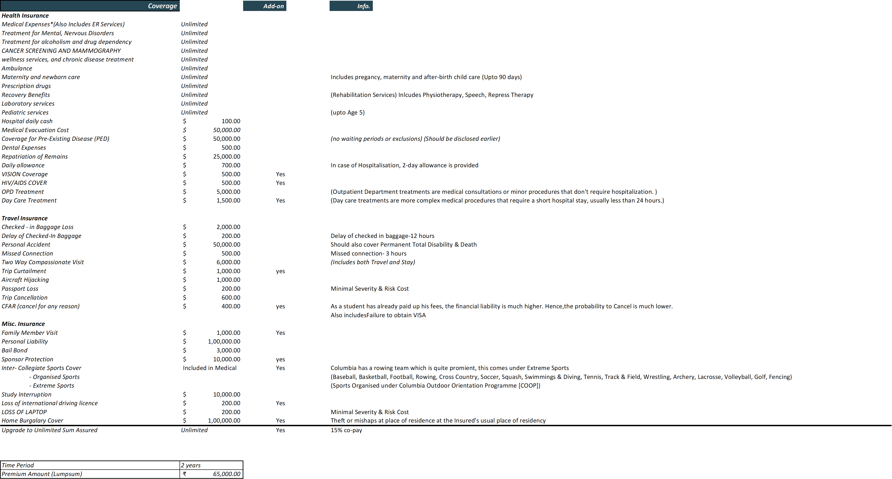

# Student_Health_Insurance



Student Health Insurance has been a slow and rising policy in the field of health and travel, where the policy mixes both the benefits to a sufficient degree, to safeguard the education tenure of an international student.
However, complaints of inadequate coverages or coverage amounts have been a major issue of this policy, along with it's nature to be lumpsum amount at the start of the policy year, it is a major setback to the marketability of the policy.

The Student Health Insurance policy curated is a 2 year policy made to compete with market standards, by comparing to adequate policies available on the market as well as the health insurance programs provided on campus by institutes and universities.
Along with this, aimmed to supply coverages which were not provided or with amounts which were deemed less than appropriate.

The Factors were priced by using the simple equation of,
```math
Risk = Severity * Frequency
```

All frequencies were cited from the most official sources manageable, as well the severities.

The Policy included many non-conventional covers such as Treatment for Mental, Nervous Disorders, Vision, HIV/AIDS, CFAR, Home Burglary Cover and an upgrade to Unlimited Sum Assured.

The Policy Pricing is kept at a modest Rs.65,000 for a 2 year policy allowing for a 2.3% net profit margin on each base policy, while the add-ons are priced seperately and the most stacked policy is priced at approximately Rs.90,000  w/ a net profit margin of 2.7%.
Loss Ratios were calculated for 5 years to check for health of the policy and the company based on exposure of each year of the policy remaining and additional businesses (without accounting for inflation or any price/cost adjustments).
